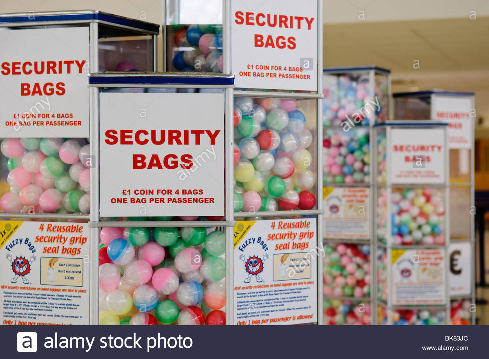
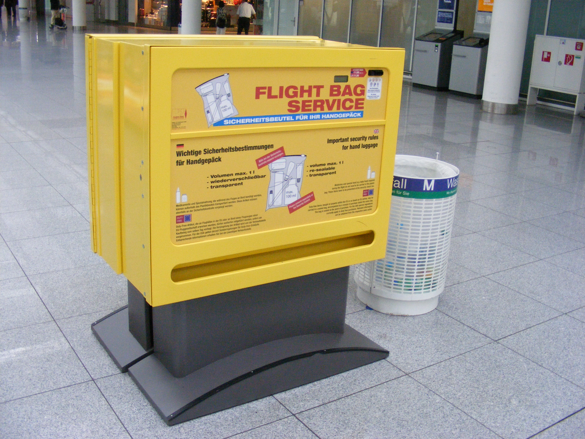
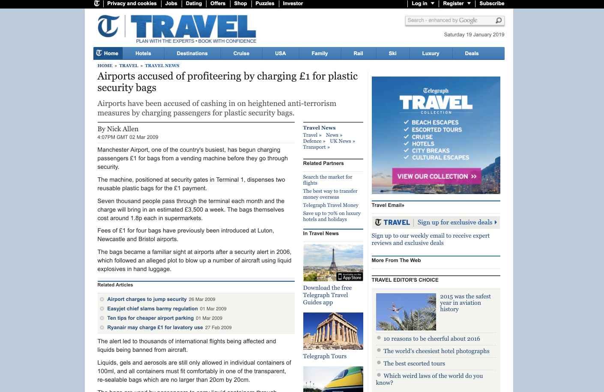
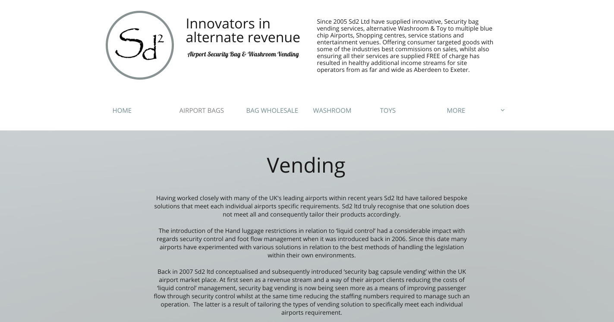
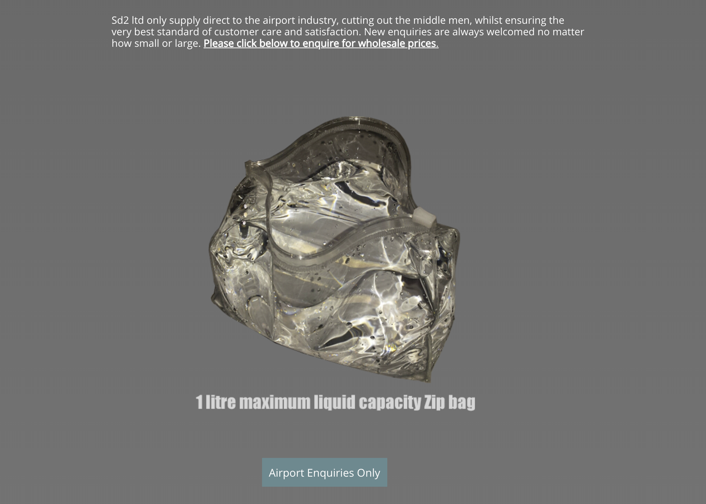

Hi BIFFUD! 

---
I'm *Fatima*

- @sugaroverflow
- Code for Canada
- Drupal Diversity

---

So what's the ~big~ *bad* idea?

---

It started with *2 things*

---

*1* 

Matt Stempeck

---

*2* 

A weird photo

---

---

Show me the __research__!

---

---

---

---

---

---

Hmmm, what about *tote bags*?

---

*AirTote*

- Your liquids bag solution *at* the airport! 

---

---

And __of course__ we need *kiosks.*

---

---

This would be *awesome* because

- Everyone __loves__ kiosks
- Security lines will be < kiosk lines

---

What *else* could we do? 

- Airport *personalized* bags!
- __Advance order__ and pick up 

---
We could *also* have

- A pick up and return __subscription model__
- Airtote *priority passes*

---

That's all there is, *there isn't any more.*

---

__Questions?__
